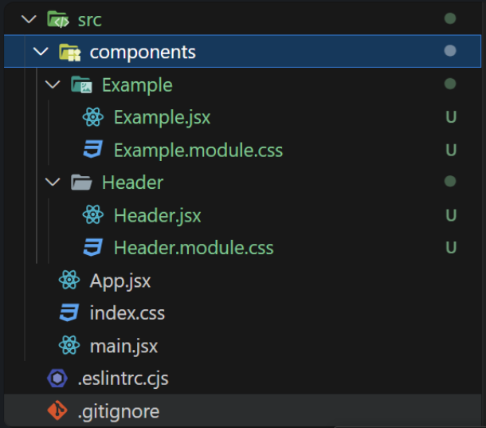
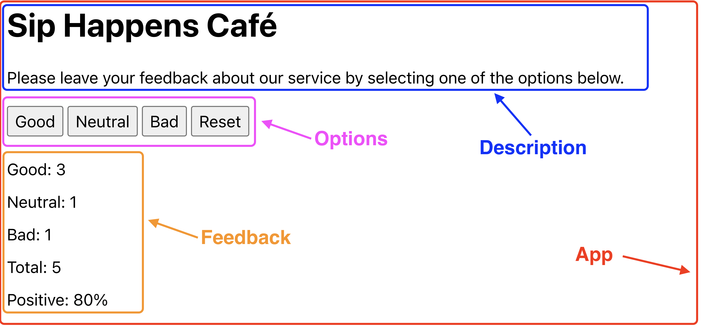
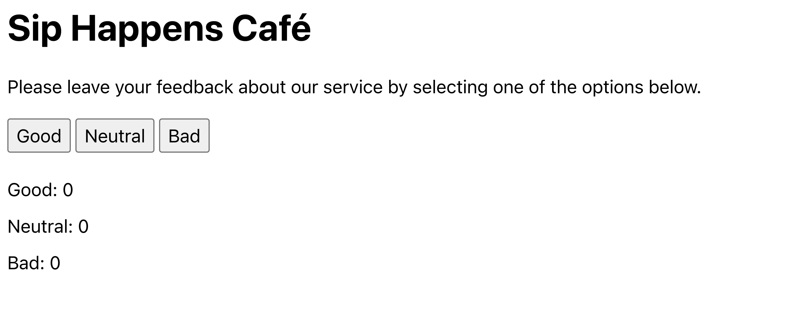

# React-hw-02-Feedback Widget

## Multi-Platform Deployment (GitHub Pages, Vercel, Netlify, Surge)

**Vercel:** [https://react-hw-02-delta.vercel.app/](https://react-hw-02-delta.vercel.app/)   
**Netlify:** [https://beamish-strudel-99565d.netlify.app/](https://beamish-strudel-99565d.netlify.app/)  

## Файли і папки

Структура папок і файлів проєкту в папці `src` має виглядати таким чином:



## Підготовка до роботи

1. Переконайся, що на комп'ютері встановлено LTS-версію Node.js.
   [Скачай та встанови](https://nodejs.org/en/) її якщо необхідно.
2. Встанови базові залежності проекту в терміналі командою `npm install`.
3. Запусти режим розробки, виконавши в терміналі команду `npm run dev`.
4. Перейдіть у браузері за адресою
   [http://localhost:3000/](http://localhost:3000/). Ця сторінка буде автоматично
   перезавантажуватись після збереження змін у файли проекту. 
   Даний Port вказаний в налаштуваннях файла конфігурації `vite.config.js`.
   Можна прибрати в налаштуваннях вказаний Port, тоді адреса за замовчуванням для локального сервера під час розробки [http://localhost:5173](http://localhost:5173).

## Домашнє завдання

+ Створен репозиторій `react-hw-02`.
+ При здачі домашньої роботи є два посилання: на вихідні файли та робочу сторінку завдання на  [Vercel](https://vercel.com/).
+ Проект створено за допомогою [Vite](https://vitejs.dev/).
+ Під час запуску коду завдання в консолі відсутні помилки та попередження.
+ Для кожного компонента у папці `src/components` є окрема папка, яка містить JSX файл самого React компонента та файл його стилів. Назва папки, файла компонента (з розширенням `.jsx`) та файла стилів (перед `.module.css`) однакова і відповідає назвам, вказаним у завданнях (якщо вони були).
+ Для експорту компонентів використовується експорт за замовчуванням (`export default`).
+ JS-код чистий і зрозумілий, використовується **Prettier**.
+ Стилізація виконана **CSS-модулями**.

## Віджет відгуків

Напиши застосунок для збору відгуків про кав'ярню **Sip Happens Café**. Подивись демо-відео роботи застосунку (Натиснути на зображення). 

[](https://www.youtube.com/watch?v=fPaqeL_J4Dk)

Застосунок повинен відображати кількість зібраних відгуків для кожної категорії: **good**, **neutral**, **bad**. Застосунок повинен зберігати статистику відгуків між оновленням сторінки.

**Компоненти**

В цьому завданні інтерфейс вже розділений на компоненти, твоя задача перенести це в код. Частини інтерфейсу, що входять в компонент, обведені рамкою відповідного кольору.



Як бачиш, всі компоненти рендеряться всередині компонента **App**.

**Назва кав'ярні**

```
Sip Happens Café
```

**Текст опису**

```
Please leave your feedback about our service by selecting one of the options below.
```

**Крок 1**

У компоненті `App` створи стан для зберігання типів відгуків. Нехай це буде об'єкт з одноіменними властивостями:

```
{
	good: 0,
	neutral: 0,
	bad: 0
}
```

Оголоси компоненти **Feedback** та **Options** і використовуй їх в **App** для відображення опцій та фідбека. Для цього передай необхідні значення їм через пропси.

Після цього кроку інтерфейс застосунку буде виглядати наступним чином. Зверни увагу, що в компонентів не вистачає деяких елементів, ти додаси їх наступних кроках.



**Крок 2**

Додай обробник стану, щоб при кліках по кнопках в компоненті **Options** змінювався стан компонента **App**.

Оголоси функцію **updateFeedback(feedbackType)**, яка приймає один параметр - тип фідбеку, тобто ім'я властивості зі стану, рядки **“good”**, **“bad”** або **“neutral”**.

```
const updateFeedback = feedbackType => {
 // Тут використовуй сеттер, щоб оновити стан
}
```

Передай функцію `updateFeedback` як пропс в компонент Options і викликай її при кліках по кнопках, передаючи тип фідбеку (рядки `“good”`, `“bad”` або `“neutral”`) як аргумент.


Після цього кроку при кліках по кнопках в компоненті **Options** буде оновлюватися інтерфейс. (Натиснути на зображення). 

[](https://www.youtube.com/watch?v=R7_7zxgUUj4)

**Крок 3**

Зроби так, щоб компонент **Feedback** рендерився тільки після того, як було зібрано хоча б один відгук. Загальна кількість відгуків - це просто сума станів:

```
const totalFeedback = good + neutral + bad;
```

Оскільки стан зберігається в компоненті `App`, то і обчислення `totalFeedback` буде правильно виконувати в цьому компоненті, і передавати вже обчислене значення пропсами іншим компонентам, а також використовувати в `App` для умовного рендерингу.

Повідомлення про відсутність статистики перенеси в компонент `Notification` і відобрази його в `App`. Для цього використовуй умовний рендеринг в компоненті `App`. (Натиснути на зображення). 

[](https://www.youtube.com/watch?v=0nEIUlmtLug)

**Крок 4**

Додай кнопку **Reset** для скидання зібраних відгуків у компонент **Options**. При кліку на неї стан, що відповідає за відгуки, повинен обнулитися. Кнопка **Reset** видима тільки в разі наявності хоча б одного відгуку, так само, як і компонент **Feedback**.

Для умовного рендерингу використовуй попередньо обчислене значення `totalFeedback` з компонента `App` і передавай його як пропс в `Options`. (Натиснути на зображення). 

[](https://www.youtube.com/watch?v=Ud7td98vD2M)

**Крок 5**

Розшир функціонал застосунку таким чином, щоб в інтерфейсі відображалося більше статистики про зібрані відгуки. Додай відображення загальної кількості зібраних відгуків з усіх категорій та відсоток позитивних відгуків. Це всі обчислювані значення, які не потрібно зберігати в стані. Передай ці значення через пропси в відповідні компоненти.

Загальна кількість відгуків - це просто сума станів:

```
totalFeedback = good + neutral + bad
```

Для підрахунку відсотка позитивних відгуків можна використовувати наступну формулу:

```
Math.round((good / totalFeedback) * 100)
```

Зверни увагу, що для значень `totalFeedback` і `positiveFeedback` не потрібно створювати окремі властивості в стані, оскільки це дані, що легко обчислюються на основі існуючого стану. Це не тільки оптимізує використання пам'яті та ресурсів, але й зменшує ризик виникнення помилок, пов'язаних із не синхронізованим станом даних.

Після цього кроку інтерфейс застосунку буде завершений. 
(Натиснути на зображення). 

[](https://www.youtube.com/watch?v=GONOudaWuhM)

**Крок 6**

Зроби так, щоб статистика відгуків зберігалася між перезавантаженнями сторінки. Використовуй ефекти та локальне сховище для збереження стану при його зміні, а при завантаженні сторінки ініціалізуй стан і локальне сховище для зчитування збережених даних та запису їх у стан. Якщо на момент завантаження додатка в локальному сховищі нічого не збережено, стан повинен ініціалізуватися нулями.